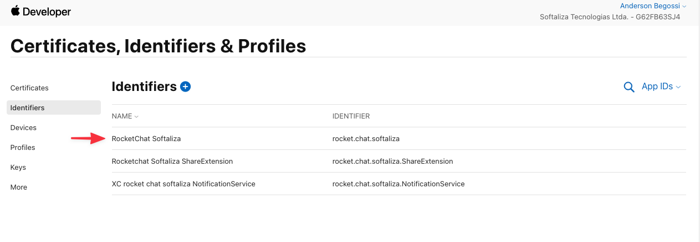
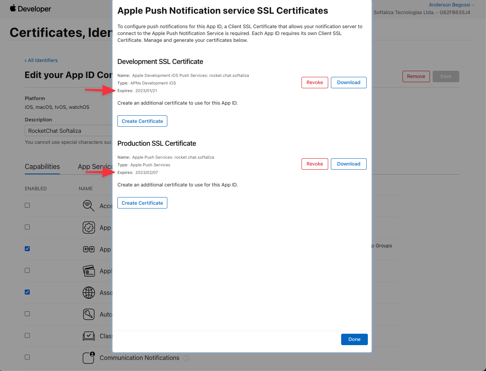

<h1 align="center">
  
</h1>

<h1 align="center">
  Camobi Segura
</h1>

<p align="center">This is a chat app to Camobi, Santa Maria - RS residents communicate with public security authorities and improve everyone's safety.</p>

<p align="center">
  <a href="https://play.google.com/store/apps/details?id=rocket.chat.softaliza">
    
  </a>
  <a href="https://apps.apple.com/br/app/camobi-segura/id1515168312">
    
  </a>
</p>

## 🎉 Starting

Install project dependencies.

```cl
yarn # or npm install
# install specific iOS dependencies
cd ios
pod install 
cd ..
```

Then start the project.

```cl
yarn react-native start --reset-cache
# start iOS app
yarn ios 
# start android app
yarn android 
```

## 📝 Updating iOS push notification certificates

iOS push notifications certificates have an expiration date. <br /> 
After that date, you must generate new certificates, otherwise iOS push notifications will stop working.

### Checking the expiration date

- Access the apple developer portal
- Access Certificates, Identifiers & Profiles
- On the Identifiers tab, click on the RocketChat Softaliza identifier



- Find Push Notifications capability and click on the Edit button
- You will see the Development and Production SSL certificates expiration



### Creating Push Notifications certificates

To generate new certificates, access [Rocket.Chat iOS white labelling docs](https://developer.rocket.chat/mobile-app/mobile-app-white-labelling/ios-app-white-labelling) and follow exactly the steps described in the **Creating Push Notifications certificates** section.

After that, you must update the certificates in the server settings. To do this, access the [server's admin panel](https://chat.camobisegura.com.br/admin/Push) and follow exactly the steps described in the **Configuring iOS** section in [Rocket.Chat configuring push notifications docs](https://developer.rocket.chat/mobile-app/mobile-app-white-labelling/configuring-push-notifications).

## 📦 Resources

The images, icons, keystore and certficates used on the app and on the android/apple stores can be found in the resources folder of this project, and also in the following links: </br>

- [Figma Camobi Segura - App icons and screenshots](https://www.figma.com/file/7bczH8xrL08V32YAaZsmks/Camobi-Segura---App-icons-and-screenshots?node-id=0%3A1) 
- [Google Drive](https://drive.google.com/drive/folders/1qbFNq_USaLRpBQN4LWOXYHgwK0xOBU1-)
